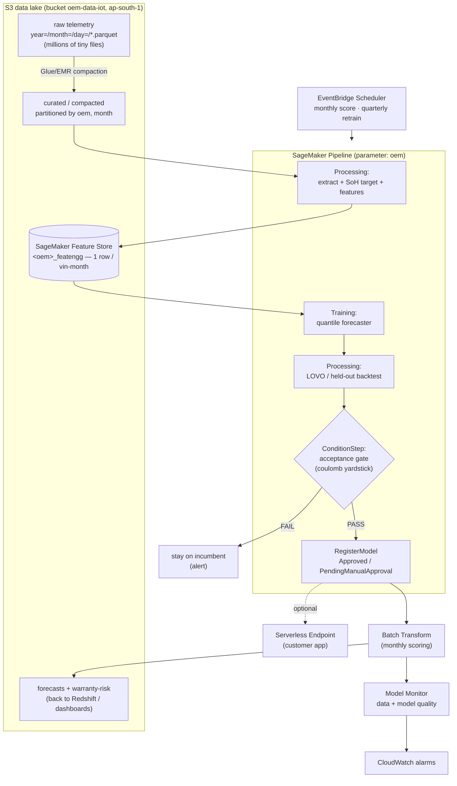
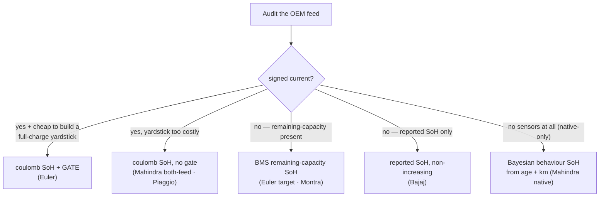

# MLOps on AWS SageMaker — Battery SoH / RUL Platform

**Audience:** an engineer standing up the production MLOps stack for this project on AWS SageMaker.
**Scope:** how the existing local pipeline (`src/*.py`, `models/<oem>/`, the dashboards) maps onto
SageMaker services — data → SoH target → features → training → **acceptance gate** → registry →
scoring → monitoring — with the multi-OEM (Euler · Mahindra · Bajaj · Piaggio · Montra)
fan-out baked in.

> Read [`README.md`](../README.md) first (the preprocessing/feature-generation runbook) and
> [`SOH_RUL_TECHNICAL_REPORT.md`](SOH_RUL_TECHNICAL_REPORT.md) (the modelling detail). This document is
> the **operational** layer on top of them.

---

## 1 · TL;DR — the mapping

| Pipeline stage (local today) | Reference code | SageMaker / AWS target |
|---|---|---|
| Raw telemetry in S3 (millions of tiny files) | `battery-oem-data/parquet/<oem>/…` | **S3 data lake** + a **compaction** job (Glue/EMR) — *do this first* |
| Extract cohort | `src/import_cohort.py`, `src/montra_sample.py` | **SageMaker Processing** (or Glue) job |
| SoH target (coulomb / BMS-capacity / reported) | `src/soh.py`, `src/euler_bms_soh.py` | same Processing job, per-OEM branch |
| Feature engineering → `<oem>_featengg` | `src/features.py`, `src/*_features.py` | **SageMaker Processing** → **Feature Store** |
| Train + backtest | `src/euler_train.py`, `src/oem_train.py` | **SageMaker Training job** (script mode) |
| Evaluate (LOVO / held-out) | inside the trainers | **Processing** evaluation step → `evaluation.json` |
| **Acceptance gate** (coulomb yardstick) | `src/euler_accept_gate.py` (exit code = verdict) | **Pipeline `ConditionStep`** gating model approval |
| Model registry (`registry.json`/`diagnostics.json` + `latest.pkl`) | `models/<oem>/` | **SageMaker Model Registry** (one Model Package Group per OEM) |
| Deploy = `load_latest(oem)` in dashboards | `oem_train.load_latest` | **Batch Transform** (monthly) + optional **Serverless Endpoint** |
| Orchestration (run scripts by hand) | — | **SageMaker Pipelines**, parameterised by `oem` |
| Schedule (quarterly retrain, per docstring) | `scripts/retrain_*.sh` (implied) | **EventBridge Scheduler** → Pipeline |
| Drift / accuracy watch (none yet) | — | **SageMaker Model Monitor** + CloudWatch |
| Secrets (`.env`, Redshift creds) | gitignored | **IAM roles** + **Secrets Manager** (no long-lived keys) |

The single most important architectural decision is **compaction of the tiny-files layout** (§3). Everything
downstream is standard SageMaker once the lake is query-shaped.

---

## 2 · Target architecture



**Cadence** (from `euler_train.py`): **monthly** feature refresh + batch scoring; **quarterly** full retrain
(as more vehicles age toward the 80 %/70 % EoL line, the training signal strengthens). Both are the same
Pipeline invoked with different parameters.

---

## 3 · The data lake and the tiny-files problem (do this first)

The raw feed is day-partitioned parquet with **~2 VINs per file** — Piaggio ~308k files, Montra ~200k+, the
Mahindra native feed on the order of 70M. A SageMaker Training or Processing job that reads these directly
will spend all its time on S3 `LIST`/`GET`, not compute. Fix it **upstream, once**:

1. **Compaction job** — AWS **Glue (Spark)** or **EMR Serverless** reads the raw partitions and rewrites to a
   **curated zone** partitioned by `oem` + `month`, target file size ~128–256 MB, `vin` as a dictionary column.
   Schedule it to append the latest ingest partitions daily. This is the one step that genuinely needs Spark;
   the rest is comfortable in pandas on a single Processing instance.
2. **Glue Data Catalog + Athena** over the curated zone, so the extract step is a partition-pruned query rather
   than a directory crawl.
3. Keep the **sentinel clipping** (SoC 0–100, |I| ≤ 400 A, V 20–120, resCapacity 1–500) in the compaction step
   so garbage never reaches feature code — same bounds as [`README.md` §2](../README.md).

> If you skip compaction, at minimum use **`S3DataDistributionType=ShardedByS3Key`** and threaded batched reads
> in the Processing job — but compaction is strictly better and removes the RAM-pressure of `vin`-category casts.

---

## 4 · Component detail

### 4.1 Preprocessing + SoH + features → SageMaker Processing

One **ProcessingStep** per OEM produces the `<oem>_featengg` table (the 32-column schema in
[`README.md` §5](../README.md)). It wraps the *existing* code with almost no change:

- Container: a custom image (§6) with `pandas · pyarrow · numpy · scikit-learn · scipy`.
- Entry point: a thin `processing/build_features.py` that calls the OEM's `*_features.py` template
  (`piaggio_features.py` for coulomb OEMs, `montra_features.py`/`euler_bms_soh.py` for BMS-capacity OEMs,
  the `bajaj_model` path for reported-SoH).
- **SoH method branches on the feed**, exactly as `config.SOH_METHOD` already encodes:

  | Feed carries | Method | Code |
  |---|---|---|
  | signed current + SoC (Mahindra, Piaggio via intellicar) | coulomb counting → isotonic | `soh.coulomb_capacity_monthly` → `capacity_to_soh` |
  | remaining-capacity (Euler, Montra) | BMS remaining-capacity → normalise → isotonic | `euler_bms_soh.py`, `montra_features.py` |
  | reported SoH only (Bajaj) | monthly median, kept non-increasing | `bajaj_model` |

- Inputs: curated S3 zone (or Athena unload). Outputs: `s3://…/featengg/<oem>/` **and** an ingest into Feature
  Store (§4.2). Instance: `ml.m5.2xlarge`/`ml.r5` for the coulomb OEMs (memory-bound pooling), scale by cohort.

> `src/mahindra_soh_methods.py` and `dashboard/mahindra_sources.py` are **local-only, uncommitted** helpers
> (the AWS build must not depend on them being in git). Port the logic into the Processing entry point, not the
> other way round.

### 4.2 Feature Store — the `featengg` contract

The featengg table is *already* a clean feature-group shape: **one row per `(vin, month)`**, immutable once a
month closes. Model it as a **SageMaker Feature Group**:

- **Record identifier:** `vin`; **event time:** `ymd` (month timestamp).
- **Offline store** (S3 + Glue catalog) → training and batch scoring read point-in-time-correct history.
- **Online store** → the customer app / real-time endpoint reads the latest vin-month at low latency.
- **Do not rename or drop columns** — `src/model.py`, `euler_model`, `bajaj_model`, `oem_train.py`, and every
  dashboard read the schema positionally-by-name; missing per-OEM columns (`dte_mean`, cell imbalance) stay `NaN`
  and the tree models tolerate it.

One feature group per OEM keeps the per-OEM column availability explicit and lets fleets version independently.

### 4.3 Training → SageMaker Training job (script mode)

`euler_train.py` and `oem_train.py` are already self-contained trainers that emit a versioned bundle + registry
+ diagnostics. Adapt them to the SageMaker Training contract:

- **Read** features from the Feature Store offline store / `SM_CHANNEL_TRAIN` instead of `data/redshift/…`.
- **Write** the model bundle to `SM_MODEL_DIR` (becomes `model.tar.gz`) instead of `models/<oem>/latest.pkl`.
- **Emit metrics** as a `evaluation.json` PropertyFile and via `print()` regex metric definitions so they land
  in the Training job's CloudWatch metrics.
- Keep the bundle shape unchanged: Euler `{rate_model, traj_model, band, meta}`;
  the generic OEMs `{model, meta}` where `model = mod.train_quantiles(mod.build_transitions(m))`.

Instance: CPU is enough (`ml.m5.xlarge`) — the models are LightGBM/XGBoost + scikit-learn isotonic. The
`torch`/`gpytorch`/`chronos` GPU stack in `requirements.txt` is **experimental/optional**; keep it out of the
production training image unless you deploy those variants (then `ml.g5`).

**Per-OEM config** currently lives in `oem_train.CFG` (`module`, `eol`, `warr_yr`). Promote it to **Pipeline
parameters** so one pipeline definition serves every fleet (§5).

### 4.4 Evaluation / backtest

The trainers already run an honest generalisation check — **LOVO** (leave-one-vehicle-out) for Euler, a by-vehicle
**60/20/20** held-out backtest for the others, each reporting `overall_rmse`, `degrading_rmse`, and a
`persistence_rmse` baseline (see `models/euler/diagnostics.json`). Split this into its own **ProcessingStep**
so the metrics are a first-class PropertyFile the gate and the registry can both consume. The
degrading-cohort-vs-persistence comparison is the number that decides whether a fleet's model is worth deploying
(Bajaj beats persistence; the noisy low-util Mahindra/Piaggio fleets don't — that fact should be visible in the
registry, not buried).

### 4.5 The acceptance gate → `ConditionStep` (the crown jewel)

`src/euler_accept_gate.py` is the project's standing safeguard and it maps **directly** onto SageMaker MLOps:

- It scores a **candidate** SoH target's forecasts against a **physically independent** yardstick (coulomb
  full-charge SoH), on the coulomb-confirmed **decliner cohort**, and returns `PASS`/`FAIL` with a **nonzero exit
  code on FAIL** — purpose-built to gate a promotion script.
- In the Pipeline: run it as a **ProcessingStep** that writes `gate.json` (`{"verdict": "PASS"|"FAIL", …}`),
  then a **`ConditionStep`** (`ConditionEquals(verdict, "PASS")`) whose *then*-branch is `RegisterModel(...,
  ModelApprovalStatus="Approved")` and whose *else*-branch registers as `PendingManualApproval` and fires an SNS
  alert. **Never auto-approve a target change that regresses the decliner cohort** — that is the whole point of
  the gate (the first `soh_label` retrain looked +30 % better against a *non-independent* yardstick and was
  correctly rejected; the hybrid target passed and shipped as `euler_20260707`).
- The gate needs the independent coulomb yardstick (`euler_full_charge_soh.py` output). Where a fleet has no
  independent yardstick (Bajaj has no current at all; Piaggio's would require scanning 308k intellicar files),
  the gate is **not applicable** — those OEMs keep their already-isotonic target and skip the ConditionStep.
  Encode that as a per-OEM `has_gate` pipeline parameter.

```python
from sagemaker.workflow.condition_step import ConditionStep
from sagemaker.workflow.conditions import ConditionEquals
from sagemaker.workflow.functions import JsonGet

gate_pass = ConditionEquals(
    left=JsonGet(step_name=gate_step.name, property_file=gate_report, json_path="verdict"),
    right="PASS")

ConditionStep(
    name="AcceptanceGate",
    conditions=[gate_pass],
    if_steps=[register_approved],          # ModelApprovalStatus="Approved"
    else_steps=[register_pending, notify], # PendingManualApproval + SNS
)
```

### 4.6 Model Registry

Replace the hand-maintained `registry.json` / `diagnostics.json` with the **SageMaker Model Registry**:

- **One Model Package Group per OEM** (`soh-forecaster-euler`, `-mahindra`, …).
- Each training run → a **Model Package** carrying the `model.tar.gz`, the evaluation metrics
  (`overall_rmse`/`degrading_rmse`/`persistence_rmse`/`band_coverage`), the acceptance-gate verdict, and the
  training lineage (which featengg snapshot, which git SHA).
- **Approval status is the deployment control**: batch scoring and endpoints deploy the *latest Approved*
  package — the registry equivalent of today's `latest.pkl`. `load_latest(oem)` becomes "fetch latest Approved
  Model Package for the group".
- Keep the per-run history you get from `registry.json` today — the Model Registry gives it to you for free, plus
  lineage back to the exact data.

### 4.7 Scoring / serving

The product is **monthly, fleet-wide** (per-vehicle SoH forecast → warranty-risk tier → RUL-in-km → dashboards),
so the default is **batch, not real-time**:

- **Batch Transform** (or a scheduled Scoring ProcessingStep) over the current-month feature snapshot → write
  forecasts + P10/P90 bands + warranty-risk tier to S3 and back to Redshift (`soh_etl.*`) for the dashboards.
- **Optional Serverless / real-time endpoint** only for the **customer app** (`dashboard/battery_status.py`) if
  it needs on-demand per-VIN answers; it reads the online Feature Store for the vehicle's latest month and
  returns the forecast. Serverless keeps cost near zero at low, spiky traffic.
- The current Streamlit dashboards can stay as-is initially, repointed from `load_latest()`/local parquet to the
  batch-scored S3/Redshift outputs.

### 4.8 Orchestration — SageMaker Pipelines

One `Pipeline` definition, **`ParameterString("oem")`** + the per-OEM knobs (`module`, `eol`, `warr_yr`,
`has_gate`, `soh_method`). Steps: `Process(features)` → `FeatureStoreIngest` → `Train` → `Process(backtest)` →
`Process(gate)` → `ConditionStep` → `RegisterModel`. Trigger once per OEM (a thin loop or a Step Functions Map),
so onboarding a new OEM is *"add a parameter set"*, not new pipeline code — the same scaling property
`oem_train.CFG` gives you today. The concrete per-OEM parameter sets are in §10.

### 4.9 Monitoring — Model Monitor + CloudWatch

Two monitors, plus one project-specific nuance:

- **Data-quality / drift monitor** on the feature inputs — baseline the featengg distributions and alarm when
  `km_month`, `ah_throughput`, `temp_mean`, SoC habits, or the sentinel-clip rejection rate drift. This catches
  a feed schema change or a new OEM firmware revision before it silently corrupts SoH.
- **Model-quality monitor** — as real SoH is observed in later months, join predictions to actuals and track
  realized forecast RMSE / bias per OEM in CloudWatch; alarm on regression. **Ground truth arrives with a
  months-long lag** (you only learn a forecast was wrong once the battery has aged), so this monitor is a slow
  trailing signal — design the alarm windows accordingly, and lean on the acceptance gate + backtest for
  *pre*-deployment confidence.
- **Cold-start fleets** (Montra, young Bajaj) sit ~flat at 100 % with zero decliners — their models are honest
  **placeholders**. Tag them in the registry and **suppress "no drift / perfect fit" alarms**; the signal only
  becomes real once the fleet ages. Likewise remember the **aged-vehicle scarcity** bias (the only EoL examples
  are early failures) makes at-risk % an **upper bound** — surface it as such in monitoring dashboards.

### 4.10 Scheduling & retraining

**EventBridge Scheduler** → Pipeline: monthly (feature refresh + batch score) and quarterly (full retrain, all
OEMs). The retrain writes new Model Packages; the gate + backtest decide whether they auto-approve. Keep the
"does this retrain actually improve accuracy?" question answerable — the registry's per-run metric history is how
you avoid churning a model that isn't getting better.

### 4.11 CI/CD

- **Code** stays in git (this repo). A **CodePipeline / GitHub Actions** build produces the Processing/Training
  **container image** (ECR) from `requirements.txt` and runs a smoke test, then updates the SageMaker Pipeline
  definition.
- Consider a **SageMaker Project** MLOps template to wire repo → build → pipeline → registry → deploy with the
  approval workflow pre-built.
- `registry.json`/`diagnostics.json` are tracked in git today as a poor-man's registry; once the Model Registry
  is authoritative they become redundant (keep emitting them only if a dashboard still reads them).

---

## 5 · Multi-OEM parameterisation (the scaling pattern)

Everything OEM-specific is already centralised — mirror it as Pipeline parameters, not forked pipelines:

| Knob | Source today | Pipeline parameter |
|---|---|---|
| SoH method | `config.SOH_METHOD` | `soh_method` (coulomb / bms_capacity / reported) |
| EoL threshold | `oem_train.CFG[oem]["eol"]` (80, Bajaj 70) | `eol_pct` |
| Warranty term | `config.FLEET_WARRANTY` / `WARRANTY` | `warr_years`, `warr_km` |
| Model module | `CFG["module"]` (`model` / `bajaj_model` / `euler_model`) | `model_module` |
| Independent yardstick exists? | (Euler only) | `has_gate` |

Adding an OEM = audit its feed → pick `soh_method` → add a parameter set → run the pipeline. The
["Add a new OEM"](../README.md) section of the README is the human checklist; this is its automation.

---

## 6 · Security, IAM, networking

- **No long-lived credentials.** The local `.env` (AWS keys, `S3_BUCKET=oem-data-iot`, `ap-south-1`) and the
  scratchpad `redshift.env` do **not** move to the cloud — replace with **IAM execution roles** (least-privilege
  per step: Processing role reads raw+curated S3, Training role reads Feature Store, scoring role writes
  forecasts) and **Secrets Manager** for the Redshift connection (used read-only, `readonly=True`).
- **Never commit secrets**; keep `.env` gitignored. This document and the Pipeline definitions must reference
  secrets by ARN, never by value.
- **Encryption:** KMS on the S3 zones, Feature Store, and model artifacts; **VPC** endpoints for S3 / SageMaker
  so telemetry never traverses the public internet; scope the SageMaker roles to the `oem-data-iot` bucket and
  the specific Feature Groups.
- **Region:** everything in `ap-south-1` alongside the data to avoid egress and latency.

---

## 7 · Cost & scaling notes

- **Compaction (§3) is the biggest lever** — it turns 308k-file scans into partition-pruned reads and cuts
  Processing wall-clock (and cost) by an order of magnitude.
- **Training is cheap** (CPU LightGBM/XGBoost, minutes) — use **Spot** for training and backtest steps.
- **Batch Transform monthly** beats an always-on endpoint for a fleet-batch product; only add a Serverless endpoint
  for genuine on-demand customer traffic.
- **Right-size Processing** by cohort: coulomb OEMs (pooled `(vin,month)` integration) are memory-bound — prefer
  `ml.r5`; BMS-capacity OEMs are lighter.

---

## 8 · Phased migration (crawl → walk → run)

1. **Crawl — lift the batch onto SageMaker.** Compaction job (§3) + one Processing job that runs the existing
   `*_features.py` for one OEM (Euler) → featengg in S3. Train with `euler_train.py` in a Training job. Manual
   approval, manual batch score. *Value: reproducible, roled, no laptop.*
2. **Walk — Feature Store + Pipeline + Registry.** Move featengg into Feature Store; wrap Process→Train→Backtest
   in a Pipeline; register to the Model Registry; wire `load_latest` → latest-Approved. Parameterise by OEM and
   onboard Mahindra/Bajaj/Piaggio/Montra.
3. **Run — gate + monitoring + schedule.** Add the acceptance-gate `ConditionStep` (Euler), Model Monitor (data
   + model quality), EventBridge monthly/quarterly triggers, and CI/CD for the container + pipeline. Customer-app
   endpoint if/when on-demand traffic warrants it.

---

## 9 · Project-specific gotchas to carry into the design

- **Tiny files dominate everything** — compact first (§3).
- **SoH method is per-feed, not global** — the branch in §4.1 is load-bearing; a wrong method silently produces
  a plausible-but-wrong target.
- **The yardstick-independence trap** — a smoother SoH target lowers *self*-error without being more accurate;
  the gate scores against a *physically independent* signal for exactly this reason. Do not let a metric that
  shares provenance with the target become the promotion criterion.
- **Ground truth lags** — model-quality monitoring is a trailing signal; pre-deployment backtest + gate carry the
  confidence.
- **Cold-start fleets are placeholders** — don't over-trust (or alarm on) a flat new-fleet model.
- **At-risk % is an upper bound** — aged-vehicle scarcity biases the training signal toward early failures;
  communicate the forecast with its P10/P90 band, never as a point estimate.

---

## 10 · Per-OEM implementation flows

One parameterised pipeline, **five parameter sets**. The steps are identical for every OEM; what changes is the
*feed audit → SoH method → whether the acceptance gate applies → whether the fleet is mature enough to deploy a
real model*. The audit decides everything downstream:



### 10.0 · Parameter sets & deltas

| OEM | Extraction | SoH method | Model module (EoL / warranty) | Gate | Fleet | Dominant gotcha |
|---|---|---|---|---|---|---|
| **Euler** | dense batch | BMS-capacity → recovery-aware clean → **hybrid** | `euler_model` (80 % / 3 y·80k) | **YES** | mature (120 veh, 74 degraders) | SoH artifacts → *needs* the clean+gate |
| **Mahindra** | two-feed: native (~70M tiny files) + intellicar (signed I) | coulomb (intellicar); **native-only → Bayesian behaviour SoH** | `model` (80 % / 3 y·120k) | no | large, ~98 % native-only | 70M tiny files; odometer logged late |
| **Bajaj** | dense native | **reported** BMS SoH, non-increasing | `bajaj_model` (70 % / 5 y·120k) | no | young (~10 mo) | no I/V → cycles/temp/eff features; odo in metres |
| **Piaggio** | intellicar (SoH) + native (features) | coulomb (intellicar) | `model` (80 % / 3 y·100k) | no | noisy low-util | 308k tiny intellicar files; native V 100 % null |
| **Montra** | day-sampled 10-veh POC | BMS-capacity (current **unsigned**) | `model` (80 % / 3 y·100k) | no | **new POC — placeholder** | unsigned current → no coulomb; flat fleet |

### 10.1 · Euler — the full path (the only OEM that activates the gate)

`Extract (dense batch)` → **two** SoH computations: the deployed target (`euler_bms_soh` → recovery-aware clean →
**hybrid** `soh_target`) *and* the physically-independent coulomb yardstick (`euler_full_charge_soh`) →
`Features → Feature Store` → `Train euler_model` (rate + trajectory + P10/P90 band) → `LOVO backtest` →
**`Gate` (`euler_accept_gate`** scores candidate vs incumbent on the coulomb-confirmed decliner cohort) →
**`ConditionStep`**: register `Approved` only on PASS → `Batch score`.
Deploys a real model (`euler_20260707`). This is the only fleet where model-quality alarms are immediately
meaningful — it has genuine decliners.

### 10.2 · Mahindra — two-tier, no gate

Two ingest paths. **Intellicar** (signed current → coulomb SoH → isotonic) covers the ~224 both-feed vehicles;
the **native** feed (the 70M-tiny-files problem → *compaction is mandatory*) covers the ~98 % with no sensors,
scored by the **Bayesian behaviour model** (`bayes_degradation`, validated MAE ~1.5 pp). No gate — the coulomb
yardstick is too sparse (~18 usable vehicles) and the `soh` target is already isotonic-clean. Register the
forecaster with its honest caveat (it does not beat persistence on the noisy cohort); the behaviour model carries
native-only coverage. Monitor: odometer availability + behaviour-model inputs (age, km).

### 10.3 · Bajaj — reported SoH, young fleet

`Dense ingest` → SoH = monthly-median of the reported `essBmsSohcEstPercValue`, kept non-increasing → features
**without** current/voltage (charge-cycles, pack temp, ambient temp, drive-efficiency, odometer ÷ 1000) →
`Train bajaj_model` → `Backtest` (this one **beats** persistence on decliners, 1.40 vs 1.85) → `Register` →
`Score`. No gate (no current at all → no independent yardstick). Warranty-risk uses the **km-effective deadline**
(120k usually binds before 5 years). Monitor: suppress premature drift alarms while the fleet is young.

### 10.4 · Piaggio — coulomb via intellicar, no gate

Intellicar ingest (**308k tiny files → compaction is the #1 cost lever**) for signed-current coulomb SoH; the
native feed supplies thermal/usage features + a distance-per-SoC cross-check (native voltage is 100 % null).
`Train model` → `Backtest` (does **not** beat persistence, 3.69 vs 2.93 → register but flag low-confidence,
communicate with wide bands). No gate — building the yardstick would mean re-scanning all 308k files.

### 10.5 · Montra — new-fleet placeholder

Day-sampled 10-vehicle extract (`montra_sample`) → SoH via BMS remaining-capacity (current is **unsigned** →
coulomb impossible) → features (has real pack temperature, a plus) → `Train model` → **flat placeholder** (0
decliners) → register as `PendingManualApproval` / tagged placeholder → score with a wide caveat. No gate.
Monitor: **cold-start — suppress "perfect-fit / no-drift" alarms**; the model becomes real as the fleet ages or
more vehicles are onboarded via `montra_sample`.

### 10.6 · Onboarding the next OEM

Audit its feed → drop it into the §10 decision tree to pick `soh_method` → add a parameter set (`model_module`,
`eol_pct`, `warr_years/km`, `has_gate`) → run the same pipeline. No new pipeline code.

---

### Appendix — script → SageMaker component

| Script | Role | Becomes |
|---|---|---|
| `src/import_cohort.py`, `montra_sample.py` | extract | Processing (or Glue) |
| `src/soh.py`, `euler_bms_soh.py`, `euler_full_charge_soh.py` | SoH target + independent yardstick | Processing |
| `src/features.py`, `src/*_features.py` | feature engineering | Processing → Feature Store |
| `src/euler_train.py`, `src/oem_train.py` | train + backtest + registry | Training job + Model Registry |
| `src/euler_accept_gate.py` | acceptance gate (PASS/FAIL exit) | Processing + `ConditionStep` |
| `src/data_quality.py` | data-thin gating | Processing filter + Model Monitor baseline |
| `src/config.py` (`CFG`, `SOH_METHOD`, `FLEET_WARRANTY`) | per-OEM registry | Pipeline parameters |
| `models/<oem>/registry.json`,`diagnostics.json`,`latest.pkl` | poor-man's registry | SageMaker Model Registry |
| `dashboard/*.py` | consumption | repoint to batch-scored S3/Redshift (+ optional endpoint) |
